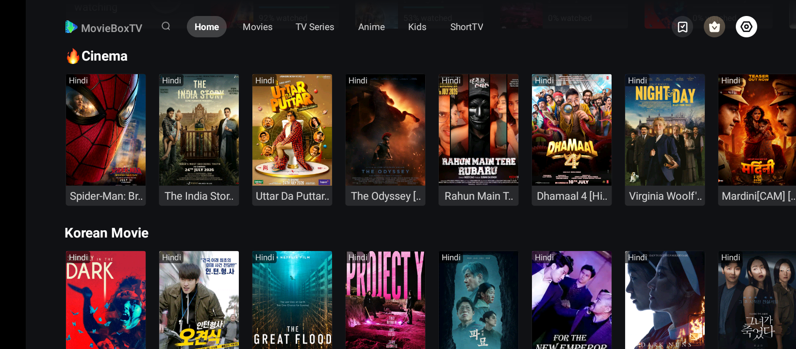
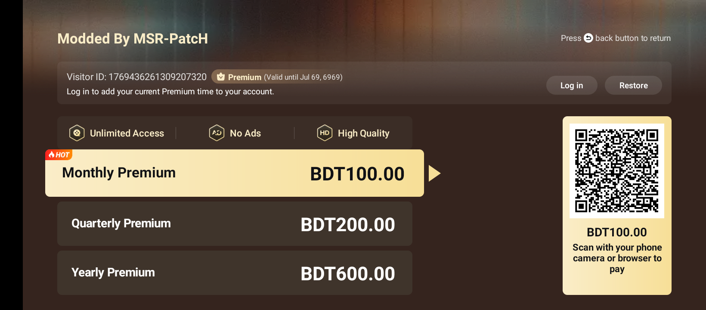
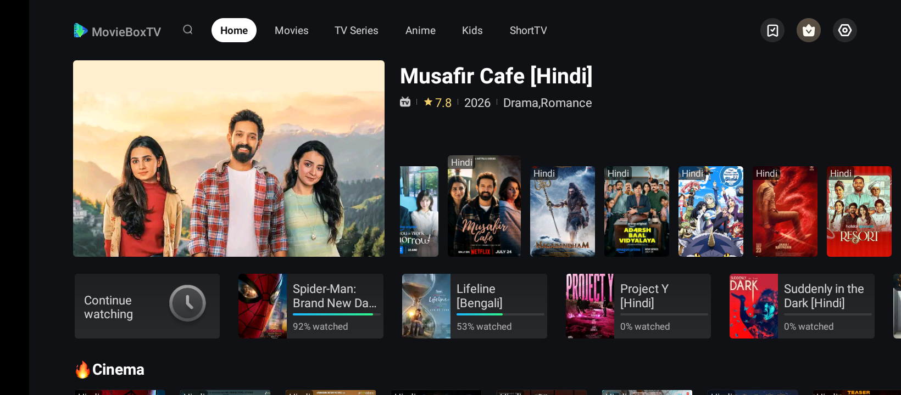

  

  # MovieBox TV Mod

  **The modified TV version of MovieBox TV — optimized for Android TV, Firestick & TV Boxes.**

---

## About

MovieBox TV Mod is a **TV-optimized version** of the popular MovieBox TV streaming application, built specifically for **Android TV, Firestick, TV boxes, and similar devices**. It brings the full entertainment experience to the big screen with an interface designed for **remote navigation** — browse and watch **movies, TV series, anime, and live content** without any subscription.

## Mod Features

- **Premium Unlocked** — all premium content accessible for free
- **New Custom Icon** — redesigned launcher icon
- **1080p+ Streaming & Download** — high-quality playback and offline downloads
- **No Ads** — clean, uninterrupted viewing experience
- **Download & Subtitle Issue Fixed**
- **TV-Friendly UI** — works smoothly with a remote control

> If you find this project useful, please consider giving this repository a **star**.

## Screenshots

  
  
  

## App Information

| | |
| :--- | :--- |
| **App Name** | MovieBox TV Mod |
| **App Version** | 1.1.6.0723.03 |
| **Platform** | Android TV, Firestick, TV Box |
| **Requirement** | Android 5.0 and above |
| **Mod By** | [MSR Sakibur](https://facebook.com/msr.sakibur) |
| **Size** | 38MB+ |
| **Category** | Entertainment |
| **Price** | Free |
| **Last Update** | 01 August 2026 |
| **Visitors** |  |
| **Downloads** |  |

## Download

## Join Community

| | |
| :--- | :--- |
| **MSR PatcH Discussion** |  |
| **MSR PatcH (Main Channel)** |  |

## Disclaimer

This is a **modified version** of MovieBox TV for educational purposes. All content and trademarks belong to their respective owners. Use at your own responsibility.
